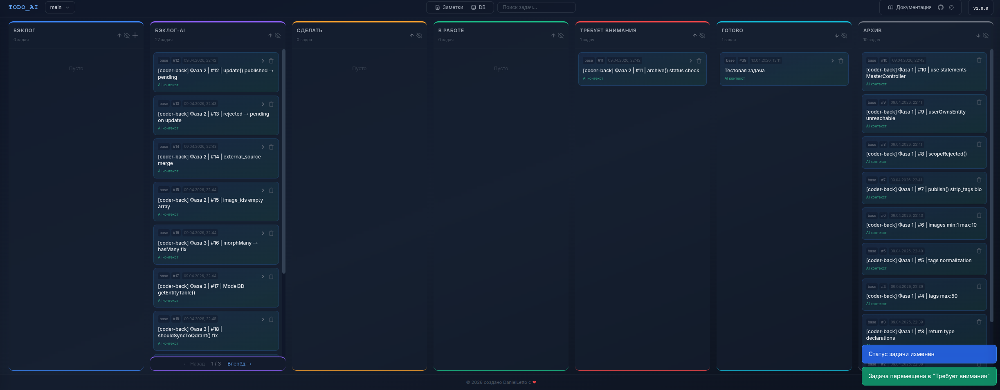
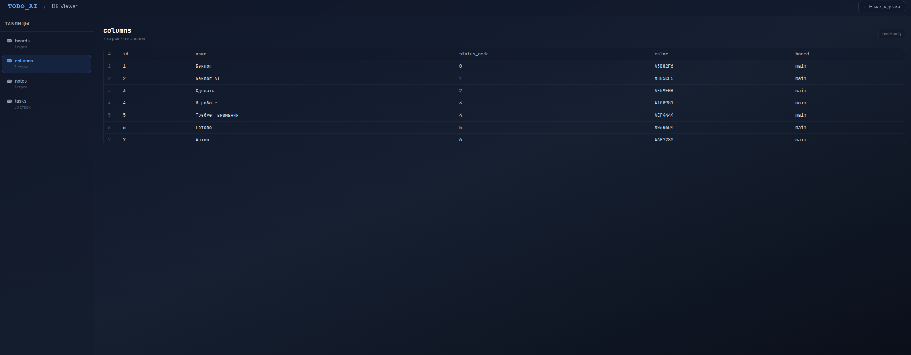
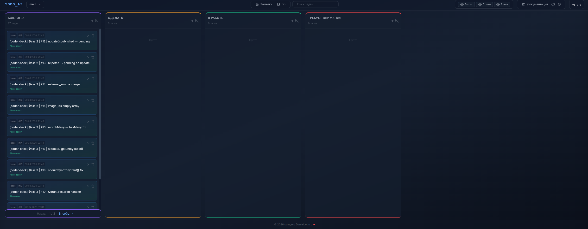
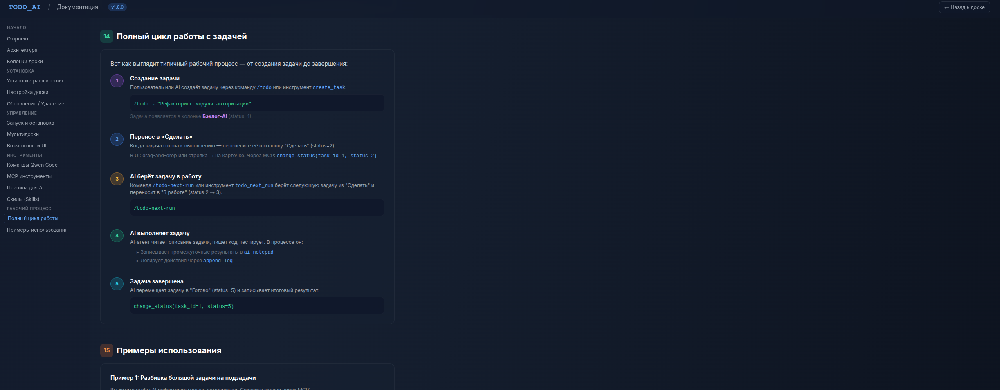

<p align="center">
  
  
</p>

# Todo AI

> Расширение для Qwen Code CLI с полноценным веб-интерфейсом — Kanban-доска для управления задачами.

## Что это такое

Todo AI — это не просто список задач в текстовом файле. Это **визуальная Kanban-доска**, которая живёт в вашем браузере и работает в связке с Qwen Code CLI.

Вы видите задачи как карточки, перетаскиваете их между колонками, фильтруете, ищете, создаёте заметки-стикеры и просматриваете базу данных — всё через удобный графический интерфейс. А AI-агент работает с той же доской через API: берёт задачи в работу, выполняет их и отчитывается о результатах.

## Что умеет

### Визуальное управление задачами

- **Drag-and-drop** — перетаскивайте карточки между колонками мышкой
- **Быстрое перемещение** — кнопка-стрелка на каждой карточке двигает её в следующую колонку
- **Панель задачи** — клик по карточке открывает полное описание, контекст для AI, чеклист и историю изменений
- **7 колонок** — от «Бэклог» до «Архив», с цветовой кодировкой статусов
- **Сортировка** — внутри каждой колонки задачи можно сортировать по приоритету или ID
- **Скрытие колонок** — уберите ненужные колонки одним кликом, чтобы не загромождать экран

### Поиск и фильтрация

- **Поиск по задачам** — строка поиска в шапке мгновенно фильтрует карточки по заголовку и описанию
- **Фильтр по статусу** — через API или UI можно показывать только задачи из определённых колонок
- **Мультидоски** — каждая доска независима: свои задачи, свои заметки, своя история. Переключайтесь между проектами одним кликом

### Заметки

- **Цветные стикеры** — создавайте заметки с 6 вариантами цвета, привязанные к доске
- **Полный CRUD** — создание, редактирование и удаление заметок прямо в интерфейсе

### База данных

- **DB Viewer** — встроенный просмотрщик SQLite базы данных. Видите таблицы, колонки, данные — без необходимости открывать SQLite клиент
- **Полная прозрачность** — все задачи, логи, чеклисты хранятся в одном файле `tasks.db`

### AI-автоматизация

- **11 MCP инструментов** — AI-агент создаёт задачи, перемещает их по колонкам, записывает результаты и логирует действия
- **Слэш-команды** — управляйте доской прямо из чата Qwen Code: `/todo`, `/todo-next`, `/todo-next-run`, `/todo-list`, `/todo-start-ui`
- **Realtime-обновления** — когда AI меняет задачу, UI обновляется мгновенно через WebSocket, без перезагрузки страницы

## Кому это нужно

- **Разработчикам** — разбивать задачи на подзадачи и видеть прогресс визуально
- **AI-пользователям** — делегировать работу AI-агенту и контролировать результат через доску
- **Командам** — каждый участник видит одни и те же задачи, а история изменений показывает кто и что сделал

## Как это выглядит

<p align="center">
  
  
  
  
</p>

Карточки можно перетаскивать между колонками, скрывать колонки, сортировать задачи внутри, фильтровать по статусу и искать по тексту.

## Архитектура

Система состоит из **двух независимых процессов**, которые работают с одной базой данных:

```
┌─────────────────────────────────────────────────────┐
│                   tasks.db (SQLite)                  │
│  Хранит ВСЕ доски: main, project-A, project-B, ...   │
└──────────┬──────────────────────┬───────────────────┘
           │                      │
           ▼                      ▼
┌─────────────────────┐  ┌─────────────────────────────┐
│   UI (браузер)      │  │  AI-агенты (MCP stdio)      │
│                     │  │                             │
│ Показывает ВСЕ      │  │ Проект A:                   │
│ доски сразу         │  │   .qwen/todo-ai.json        │
│ Переключается       │  │   → board: "project-A"      │
│ между ними          │  │   → работает с project-A    │
│                     │  │                             │
│ 🚀 Автозапуск:      │  │ Проект B:                   │
│   При старте MCP    │  │   .qwen/todo-ai.json        │
│   → UI запускается  │  │   → board: "project-B"      │
│   → indep. процесс  │  │   → работает с project-B    │
│   → живёт после     │  │                             │
│     выхода из сессии│  │                             │
└─────────────────────┘  └─────────────────────────────┘
```

### Как это работает

1. **UI** — запускается **автоматически** при старте MCP сессии. Работает как независимый процесс (`start_new_session=True`), живёт после выхода из Qwen Code. Показывает все доски и переключается между ними через интерфейс.
2. **AI-агент** — запускается автоматически Qwen Code при работе в проекте, читает `.qwen/todo-ai.json` и работает только со своей доской
3. **База данных** — одна для всех, задачи изолированы по полю `board`
4. **Несколько сессий** — первая сессия запускает UI, последующие видят что UI работает и не запускают дубликат

## Колонки доски

| Код | Название | Цвет | Кто создаёт |
|-----|----------|------|-------------|
| 0 | Бэклог | Синий | Человек |
| 1 | Бэклог-AI | Фиолетовый | AI-агент |
| 2 | Сделать | Янтарный | Любой |
| 3 | В работе | Зелёный | Любой |
| 4 | Требует внимания | Красный | Любой |
| 5 | Готово | Голубой | Любой |
| 6 | Архив | Серый | Любой |

## Быстрый старт

### Требования

- Qwen Code CLI — установлен и настроен
- Python 3.10+ — для запуска MCP сервера
- Git — если установка из репозитория

### Установка зависимостей

```bash
cd ~/.qwen/extensions/todo-ai
pip install -r server/requirements.txt
```

### Запуск

**MCP stdio (основной режим)** — запускается автоматически Qwen Code при каждом обращении к инструменту. Просто используйте команды `/todo`, `/todo-next` и т.д.

**HTTP UI (веб-интерфейс)** — **запускается автоматически** при старте каждой MCP сессии:
- При загрузке расширения MCP сервер проверяет работает ли UI на порту 8167
- Если UI не работает — запускает его как **независимый процесс** (`start_new_session=True`)
- UI продолжает работать после выхода из сессии Qwen Code
- Несколько сессий Qwen используют один UI сервер — дубликаты не создаются

> **Не нужно запускать UI вручную!** Просто откройте http://localhost:8167 в браузере.

Если нужен ручной запуск (свой порт):
```bash
cd ~/.qwen/extensions/todo-ai
python -m server.main            # порт по умолчанию: 8167
python -m server.main --port 9000  # или указать свой порт
```

Или через переменную окружения:
```bash
TODO_AI_APP_PORT=9000 python -m server.main
```

> Приоритет: аргумент `--port` > env `TODO_AI_APP_PORT` > `8167`

Откройте в браузере: http://localhost:8167

### Команда /todo-start-ui

Команда `/todo-start-ui` теперь служит для **ручной проверки** UI и открытия документации:
- Проверяет работает ли UI сервер
- Запускает если не работает (дублирует автозапуск)
- Открывает документацию в браузере через Playwright

> 💡 **Совет:** В большинстве случаев UI уже работает — просто откройте http://localhost:8167

### Документация в браузере
После запуска UI доступны:
- `http://localhost:8167/` — Kanban-доска
- `http://localhost:8167/app-docs` — Документация приложения
- `http://localhost:8167/mcp-tools` — Справка по MCP API
- `http://localhost:8167/settings` — Настройки

> UI показывает все доски и переключается между ними через интерфейс. Доска по умолчанию: **`main`** (системная, нельзя удалить или переименовать).

## Настройка доски

Каждый проект может иметь свою отдельную Kanban-доску с независимыми задачами. Создайте файл `.qwen/todo-ai.json` в корне вашего проекта:

```json
{
  "board": "my-project-name"
}
```

> AI-агент автоматически читает этот конфиг при запуске и работает только со своей доской.

### Системная доска `main`

Доска `main` создаётся автоматически при первом запуске и **является системной**:
- ✅ Используется по умолчанию если нет `.qwen/todo-ai.json`
- ❌ Нельзя удалить
- ❌ Нельзя переименовать

Это гарантирует что всегда есть хотя бы одна рабочая доска.

## Команды Qwen Code

| Команда | Описание |
|---------|----------|
| `/todo` | Создать новую задачу в Бэклог-AI |
| `/todo-list` | Показать список задач из Бэклог-AI (или с фильтром по статусу) |
| `/todo-next` | Показать следующую задачу из колонки "Сделать" (только просмотр) |
| `/todo-next-run` | Взять следующую задачу из "Сделать", выполнить и переместить в "Готово" (полный цикл) |
| `/todo-config` | Проверить или создать `.qwen/todo-ai.json` текущего проекта |
| `/todo-start-ui` | Запустить UI сервер и открыть документацию (работает из любого проекта) |

## MCP инструменты

AI-агент автоматически использует эти инструменты через MCP протокол:

### Управление задачами

| Инструмент | Описание | Параметры |
|------------|----------|-----------|
| `create_task` | Создать задачу в Бэклог-AI | `title` (обяз.), `description`, `context_ai`, `checklist` |
| `update_task` | Обновить поля существующей задачи | `task_id` (обяз.), `title`, `description`, `status`, `context_ai` |
| `get_task` | Получить полную информацию о задаче | `task_id` |
| `list_tasks` | Получить список задач с фильтром | `status` (опц., 0-6) |
| `delete_task` | Удалить задачу | `task_id` |
| `change_status` | Изменить статус (переместить в другую колонку) | `task_id`, `status` (0-6) |

### Заметки и логирование

| Инструмент | Описание | Параметры |
|------------|----------|-----------|
| `write_to_notepad` | Записать заметку в AI-блок задачи | `task_id`, `note` |
| `append_log` | Добавить запись в лог истории | `task_id`, `log_entry` |

### Управление рабочим процессом

| Инструмент | Описание | Параметры |
|------------|----------|-----------|
| `todo_next` | Показать следующую задачу из "Сделать" | — |
| `todo_next_run` | Взять задачу из "Сделать" -> "В работе" | — |
| `todo_list` | Показать задачи из "Бэклог-AI" (до 50) | `limit` (по умолч. 50) |

## Полный цикл работы

1. **Создание задачи** — через `/todo` или `create_task`. Задача появляется в "Бэклог-AI" (status=1)
2. **Перенос в "Сделать"** — drag-and-drop в UI или `change_status(task_id, status=2)`
3. **Взятие в работу** — `/todo-next-run` переносит задачу в "В работе" (status 2 -> 3)
4. **Выполнение** — AI-агент читает задачу, пишет код, записывает результаты в `ai_notepad`, логирует через `append_log`
5. **Завершение** — AI переносит задачу в "Готово" (status=5) и записывает итоговый результат

## Правила для AI-агента

- **Не создавай** задачи в статусе 0 (Бэклог) — это колонка только для людей
- **Создавай** задачи в статусе 1 (Бэклог-AI) через `create_task`
- **Всегда записывай** результаты выполнения в `ai_notepad` через `write_to_notepad`
- **Всегда логируй** действия через `append_log`
- **Если задача невыполнима** — перемести в статус 4 (Требует внимания) и объясни причину

## REST API

При запущенном HTTP сервере доступны следующие endpoints:

### Задачи `/api/tasks`

| Метод | Endpoint | Описание |
|-------|----------|----------|
| GET | `/api/tasks` | Список задач (?status=N) |
| GET | `/api/tasks/{id}` | Задача по ID |
| POST | `/api/tasks` | Создать задачу |
| PUT | `/api/tasks/{id}` | Обновить задачу |
| PATCH | `/api/tasks/{id}/status` | Изменить статус |
| DELETE | `/api/tasks/{id}` | Удалить задачу |

### Доски `/api/boards`

| Метод | Endpoint | Описание |
|-------|----------|----------|
| GET | `/api/boards` | Список всех досок |
| GET | `/api/boards/active` | Текущая активная доска |
| PUT | `/api/boards/active` | Переключить доску |
| POST | `/api/boards` | Создать новую доску |
| DELETE | `/api/boards/{name}` | Удалить доску |

### MCP `/api/mcp`

| Метод | Endpoint | Описание |
|-------|----------|----------|
| GET | `/api/mcp/tools` | Список инструментов |
| GET | `/api/mcp/docs` | Документация MCP |
| POST | `/api/mcp/tools/call` | Вызвать инструмент |

## Структура проекта

```
todo-ai/
├── qwen-extension.json      # Конфигурация расширения
├── README.md                # Этот файл
├── QWEN.md                  # Контекст для AI
├── LICENSE                  # Apache License 2.0
├── commands/                # Слэш-команды для Qwen Code
│   ├── todo.md
│   ├── todo-list.md
│   ├── todo-next.md
│   └── todo-next-run.md
├── skills/                  # Скилы для AI-агентов
├── server/
│   ├── main.py              # Точка входа (stdio/HTTP)
│   ├── requirements.txt     # Зависимости Python
│   ├── core/
│   │   ├── config.py        # Конфигурация, управление досками
│   │   ├── database.py      # SQLite, инициализация, миграции
│   │   ├── models.py        # Pydantic модели
│   │   ├── tasks_api.py     # REST API для задач + Checklist
│   │   ├── boards_api.py    # API для мультидосок
│   │   ├── notes_api.py     # API для заметок
│   │   ├── mcp_handler.py   # MCP инструменты (HTTP режим)
│   │   ├── db_api.py        # Read-only DB viewer
│   │   ├── ws_manager.py    # WebSocket менеджер
│   │   └── routes.py        # Основные роуты + UI serving
│   └── static/
│       ├── index.html       # Главная страница (Kanban доска)
│       ├── docs-app.html    # Документация
│       └── ...              # Остальные страницы UI
└── data/
    └── tasks.db             # SQLite база данных
```

## Разработка

### Локальная разработка

Для разработки используйте symlink вместо установки — изменения применяются сразу:

```bash
qwen extensions link /путь/к/todo-ai
```

### Очистка кэша

После изменения Python-файлов очистите кэш:

```bash
find . -name "__pycache__" -exec rm -rf {} +
```

### Запуск тестов

Полный цикл MCP инструментов протестирован и работает:

- `create_task` -> создание задачи
- `get_task` -> получение задачи по id_task
- `change_status` -> перемещение между колонками
- `todo_next` / `todo_next_run` -> управление рабочим процессом
- `write_to_notepad` / `append_log` -> заметки и логирование
- `update_task` -> обновление полей
- `delete_task` -> удаление
- `list_tasks` / `todo_list` -> фильтрация и поиск

## Структура задачи

```json
{
  "id": 139,
  "id_task": 42,
  "title": "Название задачи",
  "description": "Подробное описание...",
  "context_ai": "Контекст для AI-агента",
  "status": 1,
  "type": "base",
  "priority": 0,
  "log": "[...]",
  "ai_notepad": "...",
  "checklist": {
    "title": "Чеклист",
    "tasks": []
  },
  "board": "main",
  "created_at": "2026-04-10T12:00:00",
  "updated_at": "2026-04-10T12:00:00"
}
```

> Все MCP инструменты работают с `id_task` (бизнес-ID), а не с внутренним `id` базы данных.

## Устранение проблем

**Расширение не загружается**

- Проверьте что расширение в списке: `/extensions`
- Убедитесь что Python установлен: `python --version`
- Установите зависимости: `pip install -r server/requirements.txt`
- Перезапустите Qwen Code

**MCP инструменты не работают**

- Проверьте что `qwen-extension.json` настроен правильно
- Очистите кэш Python
- Все инструменты работают по `id_task`, не по `id`

**UI не открывается**

- UI сервер запускается автоматически при старте MCP сессии — проверьте: `curl http://localhost:8167/health`
- Если не работает — запустите вручную: `cd ~/.qwen/extensions/todo-ai && python -m server.main`
- Проверьте что порт свободен: `ss -tlnp | grep 8167`

## Лицензия

Copyright 2026 Максим Кузьминский

Licensed under the Apache License, Version 2.0. See [LICENSE](LICENSE) for details.
